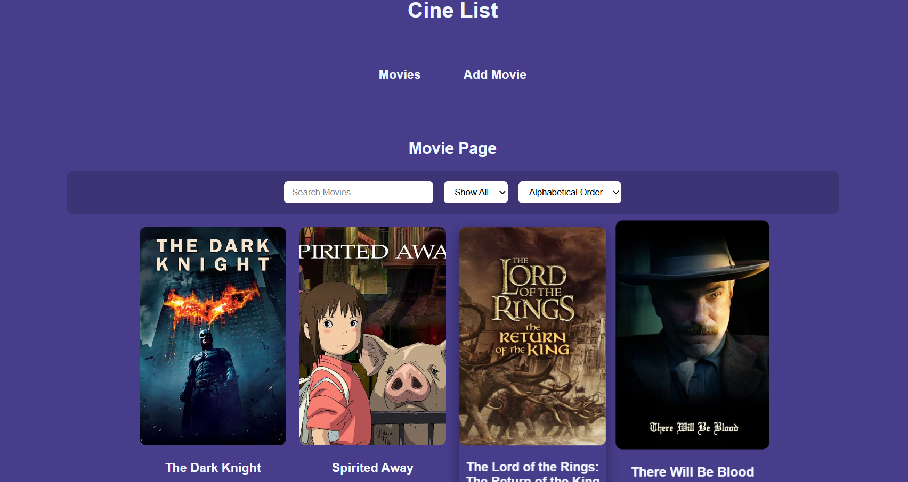
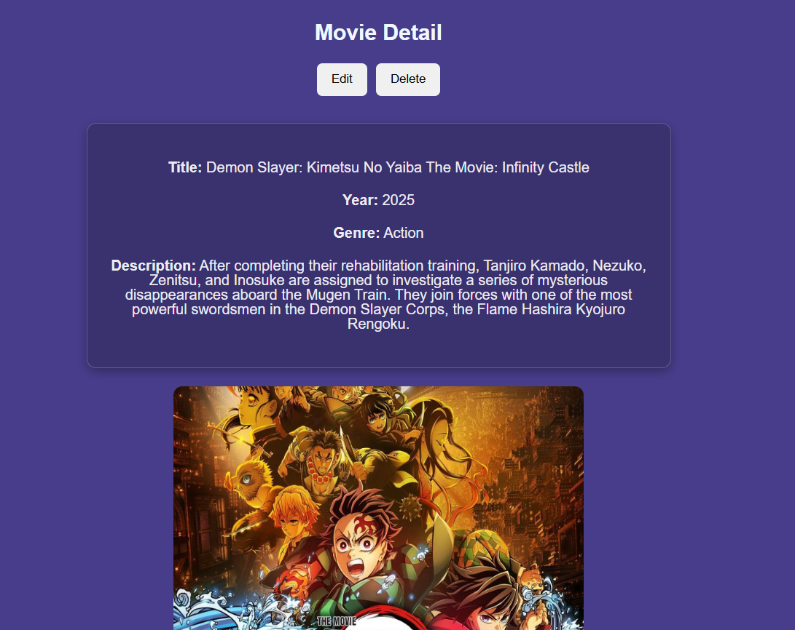
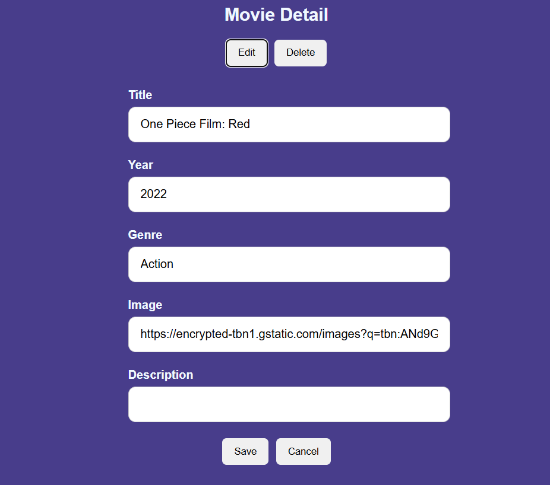

# CineList

Hi, I'm Silongo Vailolo, and this is my first React project.

CineList is a single-page application built with React that allows users to browse, add, edit, and delete movies. The project demonstrates core front-end development skills including state management, routing, and working with APIs.

## Screenshot Preview

### Home Page


### Movie Detail


### Edit Page


## Features

* View a list of movies
* View individual movie details
* Add new movies
* Edit existing movies
* Delete movies
* Search movies by title
* Filter movies by genre
* Sort movies alphabetically

## Technologies Used

* React
* React Router
* JavaScript (ES6)
* CSS
* JSON Server (mock backend)

---

## How to Run the Project

### 1. Clone the repository

```bash
git clone https://github.com/Mazkel/cinelist-frontend.git
cd cinelist-frontend
```

### 2. Start the backend (in a separate terminal)
```bash
cd cineList-backend
json-server --watch db.json --port 3001
```

### 3. Start the frontend
```bash
cd cineList-frontend
npm install
npm start
```

## Live Demo

This project uses a local JSON Server backend, so it is not deployed online.
To experience the full functionality, please run it locally using the instructions above.

## What I Learned

* Building and structuring a React application
* Managing state using React hooks
* Creating controlled components (forms)
* Implementing CRUD operations (Create, Read, Update, Delete)
* Using React Router for navigation
* Improving UI/UX with CSS styling


## Future Improvements

* Form validation
* Improved UI design
* Backend deployment
* User authentication

---
